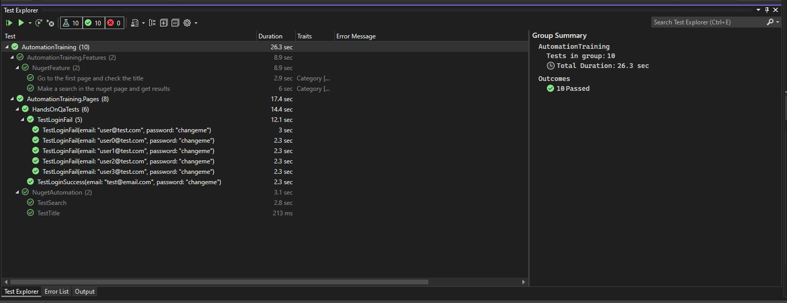

# Apex automation course day 1
---
### Summary

### Create the new project
```
dotnet new xunit -n "AutomationTraining"
```

### Adding the packages
```
cd AutomationTraining
dotnet add package FluentAssertions
dotnet add package Selenium.WebDriver
dotnet add package Selenium.WebDriver.ChromeDriver
```

---

# Apex automation course day 2
---

### Summary
* IDisposable
  * Used to kill the process once the test object is destroyed

* IClassFixture<TestBase>
  * Used for dependency injection of the shared TestBase class

* Theory and InlineData
  * Used for multiple tests with the same code and variables

* Extra
  * Github page simple login for testing purposes


# Apex automation course day 3
---
### Summary
* Added `Specflow.xUnit` dependency to the project from nuget packages

* Gherkin definition
  
* Feature files and testing with Given, When, Then, And




---

# "Sauces"
* https://fluentassertions.com/
* https://fluentassertions.com/introduction
* https://dotnet.microsoft.com/en-us/download
* https://www.lambdatest.com/blog/implicit-wait-csharp-selenium/
* 2019
  * https://marketplace.visualstudio.com/items?itemName=TechTalkSpecFlowTeam.SpecFlowForVisualStudio
* 2022
  * https://marketplace.visualstudio.com/items?itemName=TechTalkSpecFlowTeam.SpecFlowForVisualStudio2022
* https://specflow.org/learn/gherkin/

### Usefull commands 

* ##### Gitignore generator command
```
dotnet new gitignore
```

* ##### To run the tests
```
dotnet test
```

* ##### To kill the processes
```
taskkill /F /IM chromedriver.exe /T
taskkill /F /IM chrome.exe /T
```
